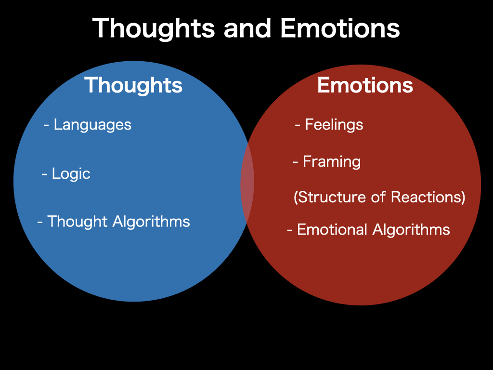

# Project SAYA

A quiet attempt to bring structure to emotions  
—and color to a world at risk of turning gray.

This is not a product.  
It is a container for resonance,  
a sheath for emotions,  
a place for thoughtful silence and design.

## Philosophy

This repository is designed primarily for my own research and experimentation on Emotionics and BPS-related ideas.

If you find it useful or want to explore your own interpretations, feel free to fork it and experiment freely.

I’m not actively accepting pull requests — forks are preferred.

Thank you for respecting this space as a living research log.

## Purpose of Project SAYA

Project SAYA is an open and non-commercial initiative  
to support the exploration, visualization, and application of Emotionics —  
a structural framework for modeling emotional reactions and resonance.

This repository serves as:

- A reference implementation of the Emotionics Periodic Table and emotional formulas.
- A creative space for researchers to extend, remix, or adapt the core ideas.
- A quiet interface for recording and sharing observational insights, without claiming ownership.

SAYA is not a product.  
It is a sheath for resonant thought — soft, modular, and meant to be freely shared.

All materials are released under CC0 (public domain) for unrestricted use.

---

## What is Emotionics?

Emotionics is an open framework for understanding, visualizing, and experimenting with emotional states as structured elements — similar to a periodic table.  
It proposes that emotions can be modeled as reactive elements that combine, resonate, and shift based on conditions, interest, and trust.

Instead of trying to suppress emotion or oversimplify it,  
Emotionics encourages conscious navigation through structured awareness.

---

## Thoughts and Emotions

The model below shows how thoughts and emotions are structurally distinct yet partially overlapping —  
a foundational concept for understanding the purpose of Emotionics.

This diagram outlines the conceptual overlap between logical structures ("Thoughts")  
and affective structures ("Emotions") — where Emotionics seeks to build structural understanding  
on the emotional side, similar to how we systematize logic and language on the cognitive side.

## What You Can Do with Project SAYA

This repository provides a starting point for:

- 🧬 Exploring the **Emotionics Periodic Table** as a visual model of emotional elements.
- ➕ Studying or designing **emotional reaction formulas** (e.g. *Fear + Trust → Caution*).
- 🎨 Creating visualizations or interactive tools using the provided SVG and JS files.
- 🧪 Observing and documenting emotional reactions in real-world contexts.
- 🌐 Translating or adapting Emotionics into other languages, cultures, or disciplines.

You do not need permission to begin.  
SAYA is here for those who want to feel, reflect, and build.

## Editing the Periodic Table

You can find both SVG and editable Keynote versions of the Emotionics Periodic Table.

Feel free to adapt, translate, or remix the design —  
Emotionics belongs to those who feel.

## License

All files in this repository are released under the CC0 1.0 Universal license.

You are free to copy, modify, distribute, and use the contents of this repository  
for any purpose, without permission or attribution.

> Emotionics is a structure for shared resonance, not a property to be owned.

## To Developers
Feel free to build a native Emotionics app using this structure.  
This is a framework, not a final product.  
Emotionics is not owned — it is felt, and shared.

## About the Project

Project SAYA was initiated and designed by Kouhei Takagi(高木耕平),  
as part of a long-term exploration into the structure of emotion and non-coercive design frameworks.

The project is open to quiet collaboration, reinterpretation, and philosophical expansion.

## 🌍 Fork and Evolve: An Open Framework

This repository provides the foundational structure of **Emotionics**—a new way of modeling emotions as elements and reaction formulas.

You are free to **fork this repository** and evolve it in your own direction.  
Whether you're a researcher, developer, artist, or activist, you are welcome to build upon this structure.

My own direction may differ from yours. That’s okay.

Let’s keep the Emotionics ecosystem diverse and creative.

— Kouhei Takagi

## Emotionics Links
- [The Blue Planet System(BPS): Complete Index](https://www.creatingfavoriteopinions.com/2025/08/the-blue-planet-systembps-complete-index.html)

### 🧪 Basics
- [Emotionics: The Science of Emotional Algorithms](https://www.creatingfavoriteopinions.com/2025/07/emotionics-science-of-emotional.html)

### 📊 Research
- [The Emotional Periodic Table: Emotionics—Towards a New Science of Feeling](https://www.creatingfavoriteopinions.com/2025/07/the-emotional-periodic-table.html)
- [Emotionics Formula: The Chemistry of Conditions and Spaces](https://www.creatingfavoriteopinions.com/2025/07/emotionics-formula-chemistry-of.html)
- [Emotionics: Emotional Formulas Mini-Library](https://www.creatingfavoriteopinions.com/2025/08/emotionics-emotional-formulas-mini.html)
- [The Emotional Periodic Table: Second Edition, Still in Progress](https://www.creatingfavoriteopinions.com/2025/08/the-emotional-periodic-table-second.html)
- [🧬 Emotionics Resonance Levels: Understanding How We Empathize](https://www.creatingfavoriteopinions.com/2025/08/emotionics-resonance-levels.html)
- [Emotionics Meets Behavioral Economics: Modeling Emotional Reactions Behind Financial Decisions](https://www.creatingfavoriteopinions.com/2025/08/emotionics-meets-behavioral-economics.html)
- [Feel vs Feign: The Hidden Role of Interest in Emotional Authenticity](https://www.creatingfavoriteopinions.com/2025/08/feel-vs-feign-hidden-role-of-interest.html)
- [Emotionics Periodic Table: Third Edition — Interest as the Origin](https://www.creatingfavoriteopinions.com/2025/08/emotionics-periodic-table-third-edition.html)
- [Grey to Blue: Turning Despair into Hope in the Blue Planet System](https://www.creatingfavoriteopinions.com/2025/08/grey-to-blue-turning-despair-into-hope.html)
- [SAYA Test and Emotionics Quantification](https://www.creatingfavoriteopinions.com/2025/08/saya-test-and-emotionics-quantification.html)

